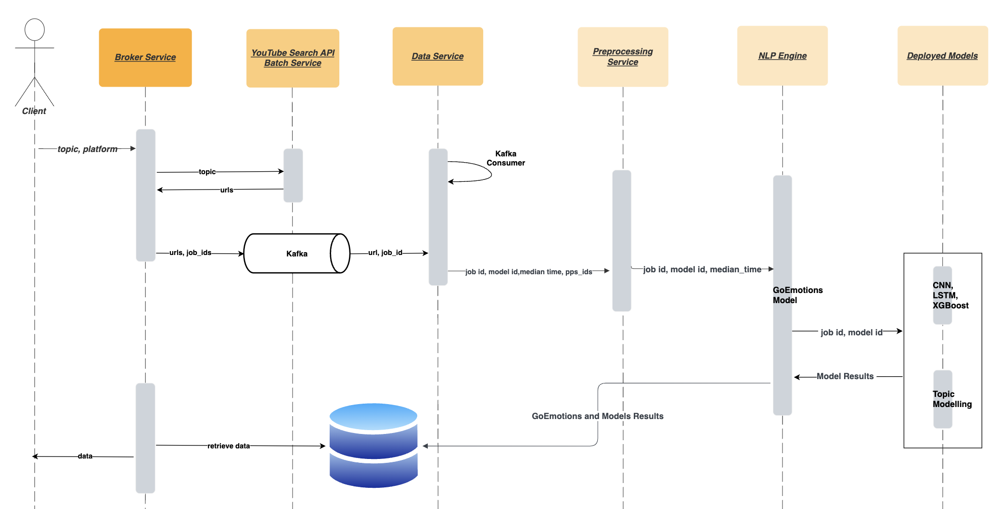

# Irish-Immigrations-Study-with-ML
  
In today’s digital age, platforms such as YouTube are not only reservoirs of entertainment but also crucial barometers of public sentiment. Most studies focus on the positive versus negative aspects of sentiment which are useful for high-level takeaways but lacks significant depth. This study delves into the intricate issue of immigration in Ireland, utilizing the state-of-the-art natural language processing (NLP) models to dissect sentiments gleaned from YouTube video comments in near real-time. 

Our methodology involves the application of multiple NLP models to continuously process, analyze, and categorize sentiments from the comments. Also, existing studies view social media as a single location or region. This assumption can prevent us from understanding scenarios such as UK or the US view towards immigration. We curated our dataset by annotating comments from Irish specific videos on immigration related issues following the annotation guidelines to train our models. Using our dataset, we found out that XGBoost along with its combination with other ML model is the best performing model with greater recall values. From our analyses, sentiments span a spectrum of emotions ranging from support and empathy to apprehension and dissent. Intriguingly, sentiments often fluctuate in tandem with video content, emphasizing the media’s profound influence on public perception. Such granular insights arm policymakers and analysts with a deepened understanding of the narratives surrounding Irish immigration. The versatility and timeliness of our approach also suggest its vast potential in gauging sentiments on other pressing societal challenges in the ever-evolving digital realm. 

## Technological Stack

ReactJS, Flask, Kafka, MongoDB, AWS RDS, Pytest, Pytorch, Docker Swarm, AWS EC2

## Sequence diagram of Backend Services

## Dashboard

